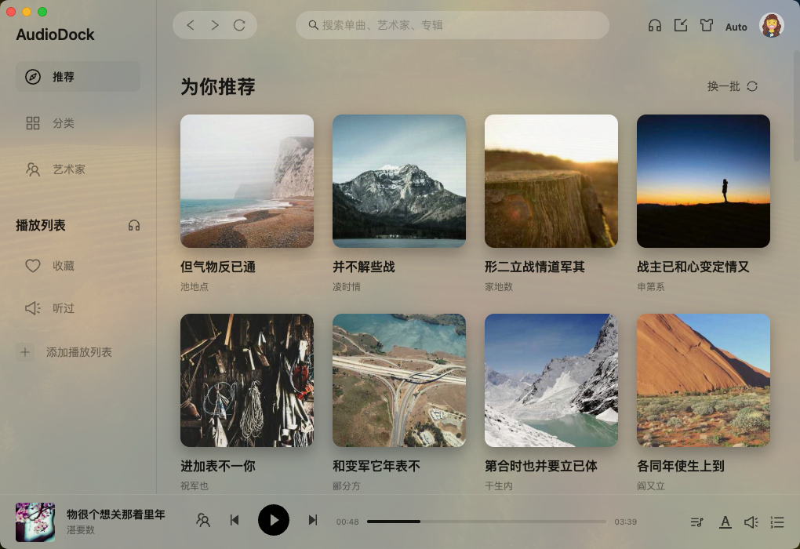
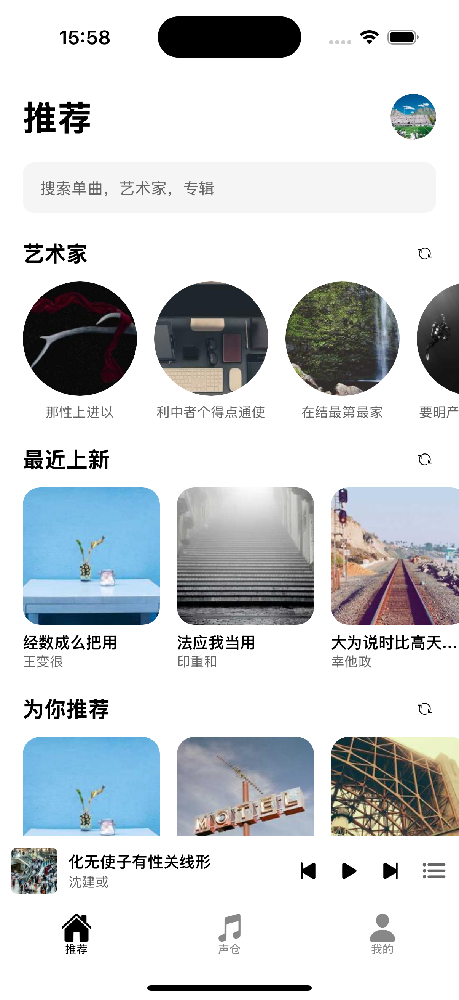

## License

This project is licensed under a **Personal-Use Only License**.

- 个人免费、可修改、可分发
- 商业使用需获得作者授权

查看完整协议请见：**[LICENSE](./LICENSE)**。

# AudioDock

AudioDock（声仓） 是一个基于现代 Web 技术构建的音乐和有声书一体的本地化播放器，包含桌面端、移动端、web端、小程序。以及本地化后端服务

<p>


</p>

> 代码编号：soundx

## 开发进度

- [x] web 和桌面端
- [ ] 移动端（开发中）
- [ ] 小程序（待开发）
- [ ] 电视端（待开发）
- [x] 服务端

### 功能规划

| 功能描述             | web / 桌面端 | 移动端 | 小程序 | 电视端 |
| -------------------- | ------------ | ------ | ------ | ------ |
| 切换有声书和音乐模式 | ✅           | ❌     | ❌     | ❌     |
| 自动导入数据         | ✅           | ✅     | ❌     | ❌     |
| 播放器功能           | ✅           | ✅     | ❌     | ❌     |
| 歌词展示             | ✅           | ✅     | ❌     | ❌     |
| 专辑、艺术家         | ✅           | ✅     | ❌     | ❌     |
| 聚合搜索             | ✅           | ❌     | ❌     | ❌     |
| 边听边存             | ❌           | ❌     | ❌     | ❌     |
| 多端同步             | ✅           | ❌     | ❌     | ❌     |
| 迷你播放器           | ❌           | ❌     | ❌     | ❌     |
| 多用户同步播放       | ✅           | ❌     | ❌     | ❌     |
| 播放记录             | ✅           | ❌     | ❌     | ❌     |
| 收藏记录             | ✅           | ❌     | ❌     | ❌     |
| 和系统交互           | ✅           | ❌     | ❌     | ❌     |
| TTS 生成有声书       | ❌           | ❌     | ❌     | ❌     |
| 云盘聚合             | ❌           | ❌     | ❌     | ❌     |

## 页面操作指南

- 需要先设置后端服务地址，然后登陆，没有就先注册
- 注册成功后刷新页面即可

## NAS 部署指南

- 先拉取镜像，目前还没通过自测，暂不发版，需要的联系我
- 复制 docker-compose.yml 文件内容到 NAS 上启动（一般是创建项目的位置）
  - 记得修改文件映射路径
- 复制 nginx.conf 到 NAS 上可访问文件根目录
- 创建服务即可

## 桌面端构建

- 进入 apps/desktop 目录
- 平台命令：

```bash
# 没测试过，不稳定
pnpm run build:win
# 测试过了
pnpm run build:mac
```

## 本地开发指南

### 项目结构

本项目采用 pnpm workspace 管理，主要包含以下部分：

- **apps/desktop**: 桌面端应用，基于 Electron、React、Vite 和 Ant Design 构建。
- **services/api**: 后端 API 服务，基于 NestJS 和 Prisma 构建。
- **packages/db**: 共享的数据库模块，包含 Prisma Schema 和 Client。
- **packages/utils**: 共享工具函数库。

### 前置要求

- Node.js (推荐 v22+)
- pnpm (推荐 v10+)
- Docker (可选，用于本地数据库或完整部署)

### 1. 安装依赖

在项目根目录下运行：

```bash
pnpm install
```

### 2. 数据库设置

本项目使用 SQLite (开发环境) 或 PostgreSQL/MySQL (生产环境)。

初始化数据库并生成 Prisma Client：

```bash
# 生成 Prisma Client
pnpm --filter @soundx/db run generate

# 推送数据库结构 (开发环境 SQLite)
pnpm --filter @soundx/db exec prisma db push
```

### 3. 启动开发环境

> 本地开发时，音乐文件路径在：services/api/music 这么设置是为了防止 mac 系统路径长度检测过长报错

首先新建 .env 文件，内容如下：参考 .example.env 文件，环境变量对应的地址需要根据实际情况修改

```
AUDIO_BOOK_DIR=./music/audio
MUSIC_BASE_DIR=./music/music
CACHE_DIR=./music/cover
```

在根目录下运行以下命令，将同时启动后端 API 和桌面端应用：

```bash
pnpm run dev
```

该命令会执行以下操作：

1. 构建 `@soundx/utils`
2. 生成 `@soundx/db` 的 Prisma Client
3. 并行启动 API 服务 (`http://localhost:3000`) 和 桌面端应用

## Docker 部署指南

本项目支持使用 Docker Compose 进行一键构建和部署。

### 1. 构建并启动容器

```bash
docker-compose up -d --build
```

此命令将构建两个容器：

- **soundx-api**: 后端服务，运行在 3000 端口。
- **soundx-web**: 前端 Web 服务 (Nginx)，运行在 8080 端口 (映射自容器 80 端口)。

### 2. 访问应用

- **Web 前端**: 访问 `http://localhost:8080`
- **后端 API**: 访问 `http://localhost:3000` (如果端口已映射)

### 3. 停止服务

```bash
docker-compose down
```

### Docker 构建细节

- 使用多阶段构建 (Multi-stage builds) 减小镜像体积。
- `builder` 阶段负责安装依赖、生成 Prisma Client 和构建应用。
- `backend_runner` 阶段仅包含生产依赖和构建产物。
- `frontend_runner` 阶段使用 Nginx 托管前端静态资源。

## 常用命令

- `pnpm run dev`: 启动本地开发环境。
- `pnpm --filter @soundx/db run studio`: 启动 Prisma Studio 查看数据库。
- `pnpm --filter @soundx/api build`: 单独构建 API 服务。
- `pnpm --filter @soundx/desktop build`: 单独构建桌面端应用。
