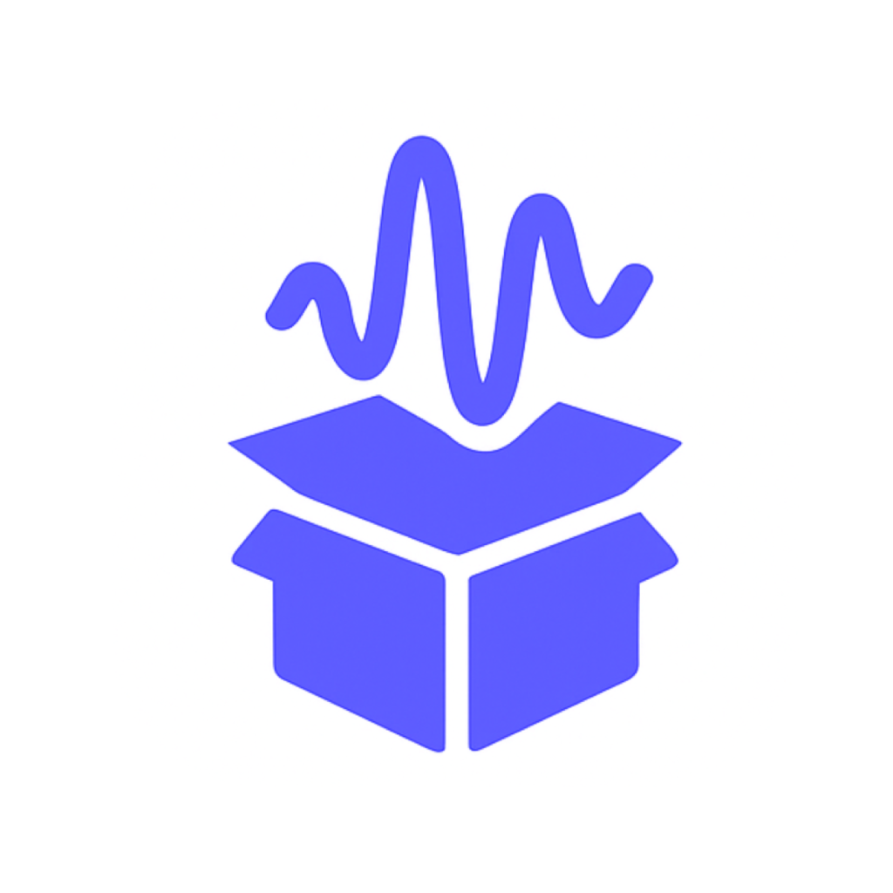
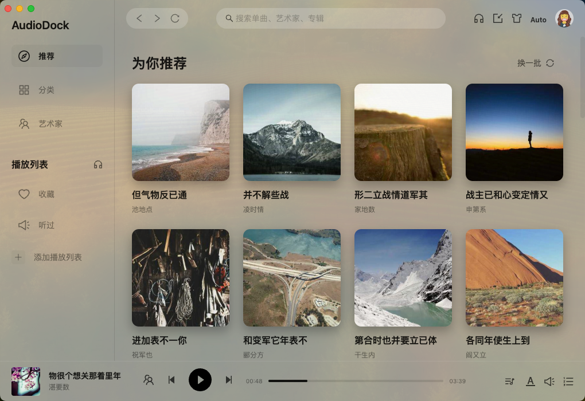
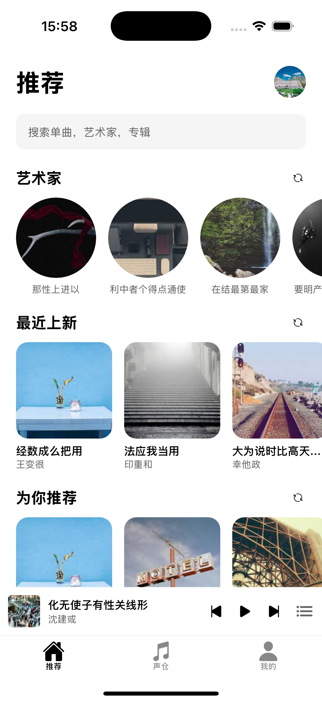

## License

This project is licensed under a **Personal-Use Only License**.

- 个人免费、可修改、可分发
- 商业使用需获得作者授权

查看完整协议请见：**[LICENSE](./LICENSE)**。

# AudioDock

<p align="center">

</p>

AudioDock（声仓） 是一个基于现代 Web 技术构建的音乐和有声书一体的本地化播放器，包含桌面端、移动端、web端、小程序。以及本地化后端服务

- **多端支持 💻**：包含移动端、web端、桌面端、小程序、电视端！
- **多端数据源支持 🔌**：支持 emby、jellyfin、Navidrome 数据源接入！
- **多协议数据入库 ⚡️**：支持 strm、webdav 数据源入库！
- **双模式无缝切换 ♻️**：有声书、音乐模式一键无缝切换，记忆不同模式下的播放信息！
- **支持 docker 部署 📦**：可以通过 docker 部署服务端和 web 端！
- **多用户支持 👥**：支持多用户交互联动！
- **设备接力 📱**：支持多设备之间无缝切换！
- **解析元数据 🖼️**：如果是带元信息的歌曲，可以展示歌词、封面等信息！

<p>


</p>

> 代码编号：soundx

## 下载

最新版本看这里：

- **[web端和服务端](https://github.com/mmdctjj?tab=packages&repo_name=AudioDock)**：找到每个包最新的下载命令 docker 下载即可
- **[桌面端、移动端](https://github.com/mmdctjj/AudioDock/releases)**：下载对应平台的版本

## 开发进度

- [x] web 和桌面端
- [x] 移动端
- [ ] 小程序（待开发）
- [ ] 电视端（待开发）
- [x] 服务端

### 功能规划

✅：完成 ❌：未开发/未完成开发 🚫：无设计

| 功能描述             | web / 桌面端 | 移动端 | 小程序 | 电视端 |
| -------------------- | ------------ | ------ | ------ | ------ |
| 切换有声书和音乐模式 | ✅           | ✅     | ✅     | ✅     |
| 自动导入数据         | ✅           | ✅     | ✅     | ✅     |
| 播放器功能           | ✅           | ✅     | ✅     | ✅     |
| 歌词展示             | ✅           | ✅     | ✅     | ✅     |
| 专辑、艺术家         | ✅           | ✅     | ✅     | ✅     |
| 聚合搜索             | ✅           | ✅     | ✅     | ❌     |
| 边听边存             | ✅           | ✅     | 🚫     | ❌     |
| 多端同步             | ✅           | ✅     | ❌     | ❌     |
| 迷你播放器           | ✅           | 🚫     | 🚫     | 🚫     |
| 多用户同步播放       | ✅           | ✅     | ❌     | ❌     |
| 播放记录             | ✅           | ✅     | ✅     | ✅     |
| 收藏记录             | ✅           | ✅     | ✅     | ✅     |
| 桌面歌词             | ✅           | ❌     | 🚫     | 🚫     |
| 和系统交互           | ✅           | ✅     | 🚫     | 🚫     |
| TTS 生成有声书       | ✅           | ✅     | 🚫     | 🚫     |
| 云盘聚合             | ✅           | ✅     | 🚫     | 🚫     |

<p align="center">

</p>

<p align="center">产品动态欢迎关注官方公众号：声仓</p>

## 页面操作指南

- 需要先设置后端服务地址，然后登陆，没有就先注册
- 注册成功后刷新页面即可

## NAS 部署指南

- 先拉取镜像
- 复制 docker-compose.yml 文件内容到 NAS 上启动（一般是创建项目的位置）
  - 记得修改文件映射路径
- 复制 nginx.conf 到 NAS 上可访问文件根目录
- 创建服务即可

```yaml
version: "3.8"

services:
  app:
    platform: linux/amd64
    image: mmdctjj/audiodock:latest
    container_name: audiodock-app
    ports:
      - "8858:3000"
      - "9958:9958"

    environment:
      - NODE_ENV=production
      - TXT_BASE_DIR=/txt # 小说目录
      - AUDIO_BOOK_DIR=/audio # 有声书目录
      - MUSIC_BASE_DIR=/music # 音乐目录
      - MV_BASE_DIR=/mv # mv视频目录
      - CACHE_DIR=/covers # 封面目录
      - DATABASE_URL=file:/app/packages/db/prisma/dev.db # 数据库路径
      - JWT_SECRET=/.jwt_secret # JWT 密钥
      - PORT=3000 # 端口，这里修改上面的 ports 中的端口也需要同步修改
      - STRM_ADDRESS=http://192.168.1.12:5244 # strm 服务地址，没有可不填
      - WEBDAV_MUSIC_URL=http://192.168.1.12:5005/音乐 # 音乐目录地址，没有可不填
      - WEBDAV_AUDIOBOOK_URL=http://192.168.1.12:5005/有声书 # 有声书目录地址，没有可不填
      - WEBDAV_MV_URL=http://192.168.1.12:5005/视频 # mv视频目录地址，没有可不填
      - WEBDAV_USER=admin # 用户名，没有可不填
      - WEBDAV_PASSWORD=123456 # 密码，没有可不填
      - DISABLE_TTS=${DISABLE_TTS:-false} # 是否禁用 TTS 功能
      - DISABLE_ASR=${DISABLE_ASR:-false} # 是否禁用 ASR 功能
      - LLM_PROVIDER=${LLM_PROVIDER:-deepseek} # LLM 提供商
      - LLM_MODEL=${LLM_MODEL:-deepseek-chat} # LLM 模型
      - LLM_BASE_URL=${LLM_BASE_URL:-} # LLM 服务地址
      - LLM_TIMEOUT=${LLM_TIMEOUT:-60000} # LLM 超时时间
      - LLM_TEMPERATURE=${LLM_TEMPERATURE:-0.7} # LLM 温度
      - LLM_MAX_TOKENS=${LLM_MAX_TOKENS:-2048} # LLM 最大 token数
      - LLM_API_KEY=${LLM_API_KEY:-} # LLM API 密钥

    volumes:
      - /volume1/txt:/txt
      - /volume1/audio:/audio
      - /volume1/music:/music/
      - /volume1/mv:/mv
      - ./covers:/covers
      - app-db:/app/packages/db/prisma
      - ./.jwt_secret:/.jwt_secret
      - ./nginx.conf:/etc/nginx/nginx.conf:ro

    restart: unless-stopped
    networks:
      - audiodock-network

volumes:
  app-db:

networks:
  audiodock-network:
```

## 本地运行

### 前置要求

- Node.js (推荐 v22+)
- pnpm (推荐 v10+)
- Docker (可选，用于本地数据库或完整部署)

### 运行

- 复制 services/api、 packages/db 包 根目录下的 .env.example 文件，修改名称为 .env
- 修改下面文件路径

```
AUDIO_BOOK_DIR=./music/audio
MUSIC_BASE_DIR=./music/music
CACHE_DIR=./music/cover
```

然后运行下面的命令，自动打开桌面端

```bash
nvm use 22
pnpm install
npm run dev
```

移动端需要进入 /apps/mobile 目录启动：

```
npx expo run:ios --device
```

## docker 启动

修改 docker-compose 的环境变量 和 volumes：

```
environment:
  - AUDIO_BOOK_DIR=/audio
  - MUSIC_BASE_DIR=/music
  - CACHE_DIR=/covers
  - DATABASE_URL=file:/data/dev.db
  - JWT_SECRET=/.jwt_secret # JWT 密钥

# 多目录示例（使用英文逗号或分号分隔）
# environment:
#   - AUDIO_BOOK_DIR=/audio,/audio2
#   - MUSIC_BASE_DIR=/music,/music2
#   - TXT_BASE_DIR=/txt,/txt1

# 挂载数据文件和缓存，使用 Docker 命名卷更安全
volumes:
  - ./audio:/audio
  - ./music:/music
  - ./covers:/covers
  - api-db:/data
  - ./jwt_secret:/.jwt_secret

# 多目录示例：每个宿主目录需要挂载到不同的容器路径
# volumes:
#   - ./audio:/audio
#   - ./audio2:/audio2
#   - ./music:/music
#   - ./music2:/music2
#   - ./txt:/txt
#   - ./txt1:/txt1
#   - ./covers:/covers
#   - api-db:/data
#   - ./jwt_secret:/.jwt_secret
```

根目录下运行构建命令：

```
docker-compose build --no-cache
docker-compose up
```

## 赞赏我

开发不易，感谢🙏赞赏支持！我会努力更新的！

<p align="center">

</p>

## ⭐ Star History

[](https://star-history.com/#mmdctjj/AudioDock&Date)
